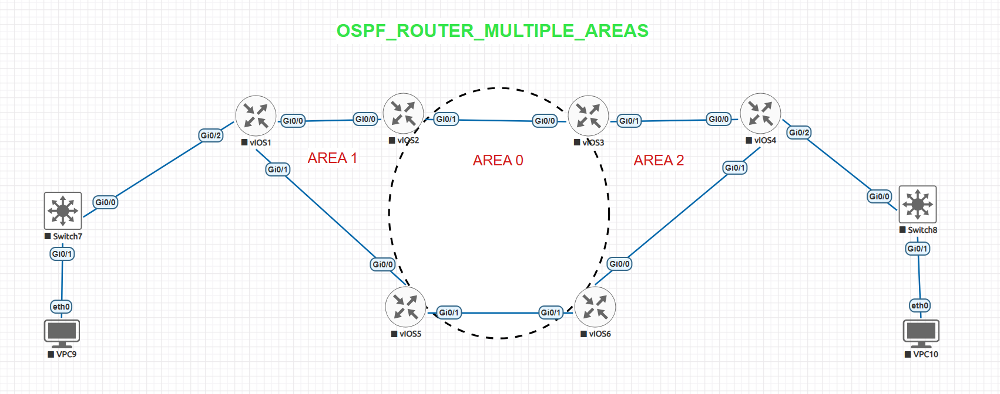

# OSPF Multiple Areas

This is a small OSPF multi-area lab that I built in EVE-NG while practicing CCNA routing concepts.

The lab uses 6 Cisco IOSv routers and 2 VPCs. The network is divided into Area 0, Area 1 and Area 2 to understand OSPF neighbor formation, route exchange and communication between different networks.

## Topology

## Network Overview

- 6 Cisco IOSv routers
- 2 VPCs
- OSPFv2
- Area 0 – Backbone
- Area 1
- Area 2

## OSPF Areas

| Area | Routers |
|---|---|
| Area 1 | R1, R2, R5 |
| Area 0 | R2, R3, R5, R6 |
| Area 2 | R3, R4, R6 |

## What I Practiced

- OSPF configuration on Cisco routers
- OSPF Router ID configuration
- OSPF neighbor adjacency
- Multi-area OSPF
- Inter-area route learning
- Routing table verification
- Basic OSPF troubleshooting
- End-to-end connectivity testing

## Verification

All required OSPF neighbor relationships reached the **FULL** state.

Remote networks were learned through OSPF and appeared in the routing tables.

VPC9 and VPC10 were also tested successfully:

**VPC9 (10.0.0.10) → VPC10 (11.0.0.10)

**VPC10 (11.0.0.10) → VPC9 (10.0.0.10)

## Files

- **Configurations/** – Router configurations
- **Screenshots/** – Topology and routing-table evidence
- **Verification/** – OSPF and connectivity results

## Tools Used

**EVE-NG | Cisco IOSv | VPCS**

This lab gave me practical experience with configuring, verifying and troubleshooting OSPF multi-area routing.