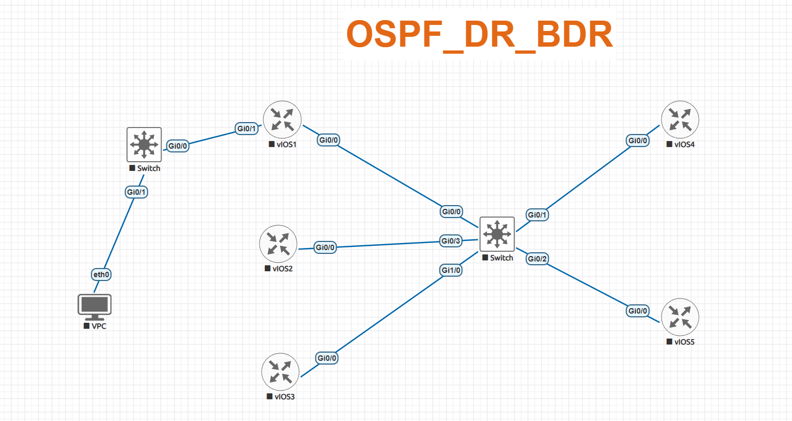
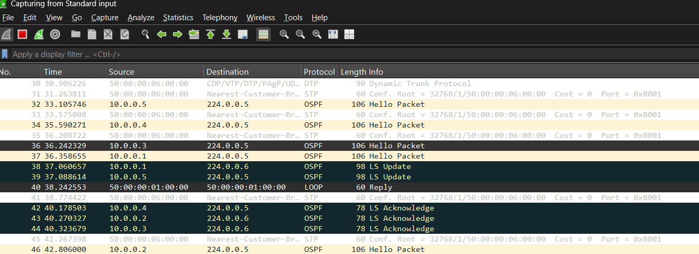

# OSPF DR/BDR – EVE-NG Lab

This lab was created in EVE-NG to understand OSPF DR (Designated Router) and BDR (Backup Designated Router) election on a broadcast network.

## 1. Topology

Five Cisco IOSv routers are connected through a common switch and configured in OSPF Area 0.

## 2. Lab Objectives

- Configure OSPF on a broadcast network
- Understand DR and BDR election
- Verify OSPF neighbor relationships
- Verify OSPF-learned routes
- Observe OSPF multicast traffic using Wireshark

## 3. DR/BDR Election Result

**DR:** Router 5 – 5.5.5.5

**BDR:** Router 4 – 4.4.4.4

The OSPF neighbor table confirmed the DR and BDR roles, while the remaining routers formed OSPF adjacencies with them.

## 4. Verification

The following commands were used:

- `show ip ospf neighbor`
- `show ip route`

The routing tables confirmed that remote networks were successfully learned through OSPF.

## 5. Wireshark Evidence

Wireshark was used to observe OSPF multicast communication during the DR/BDR operation.

### Multicast Addresses

**224.0.0.6 – AllDRouters**

Used by OSPF routers to send link-state updates to the DR and BDR.

**224.0.0.5 – AllSPFROUTERS**

Used for OSPF communication with all OSPF routers on the network.

The packet capture shows OSPF Hello, LS Update and LS Acknowledgment packets. The capture demonstrates communication toward the DR/BDR using 224.0.0.6 and OSPF communication to all routers using 224.0.0.5.

## 6. Result

- OSPF neighbor relationships were successfully established.
- Router 5 (5.5.5.5) was elected as DR.
- Router 4 (4.4.4.4) was elected as BDR.
- Remote networks were successfully learned through OSPF.
- Wireshark captured OSPF multicast communication during the lab.

## 7. Tools Used

EVE-NG  
Cisco IOSv  
VPCS  
Wireshark